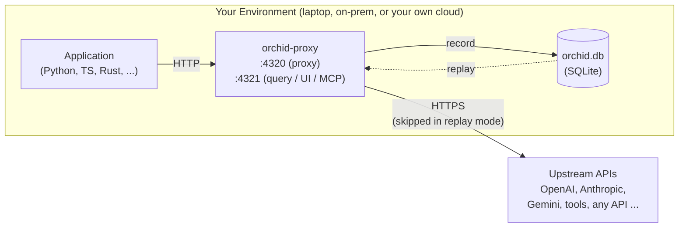

# Orchid — Record, Inspect, Replay AI Agents

[Orchid Website](https://orchidtrace.xyz)

**Stop grepping logs.** Orchid records your agent's network traffic — LLM calls, tool invocations, and any other API your agent talks to — through a zero-instrumentation proxy. Then it lets you:

*   **Time-travel** through completed runs, step by step
*   **Inspect** every prompt, response, token count, and cost
*   **Debug** failures in the built-in web UI or via MCP tools from your IDE
*   **Replay** recorded runs offline — deterministic tests with zero API cost

**Orchid gives your coding agent the ability to debug your AI app.** The proxy has a built-in MCP server, so when an LLM call is buried deep in your stack — behind a framework, a queue, three layers of abstraction — your AI assistant in Cursor, VS Code, or Claude Desktop can query the recorded traffic directly. No print statements, no log spelunking: ask your agent *"why did this run fail?"* and it can go look, figure out why, and fix it for you.

You choose how much to record: route only your LLM traffic through the proxy for lightweight inspection, or capture everything for the full picture. To **replay** a run with perfect fidelity, all of the agent's network traffic must go through the proxy — replay works by serving back the recorded responses, so anything that wasn't recorded can't be replayed.

> **IMPORTANT!**
>
> **Your data never leaves your infrastructure.** Orchid is not a data exfiltration vector!
>
> *   The proxy forwards requests **only** to the upstream APIs your app was already calling.
> *   Everything recorded stays in a local SQLite database inside the container (or your mounted volume). No phone-home, no telemetry, no cloud backend.
> *   Secrets are scrubbed in memory **before** anything is written to disk: `Authorization` headers are forwarded untouched to the upstream but never stored, and headers, query strings, and body fields with secret-like names (keys, tokens, passwords, credentials, cookies) are stored as `[REDACTED]`.
> *   One honest caveat: redaction works by recognizing field *names* (like `api_key` or `authorization`), not by scanning the contents of your prompts. Prompt and completion text is recorded verbatim — that's the whole point of Orchid — so if a secret is pasted into a prompt, it will be stored along with the rest of the prompt text.


This repository contains the open-source Orchid SDKs and user documentation. The `orchid-proxy` container is distributed via the GitHub Container Registry (see below). Content here is synced automatically from the main development repository — issues and discussions are welcome; pull requests may be ported rather than merged directly.

---

## How It Works



### Non-Intrusive Interception (Thin SDK)

Unlike traditional LLM observability tools that require wrapping every client initialization or using heavy SDKs with AST modifications, Orchid uses an **APM-style Thin SDK**. The SDK patches the foundational HTTP transport layer (`httpx`/`requests` in Python, `fetch` in Node, `reqwest` middleware in Rust), so every LLM call made by standard client libraries is automatically routed through the local or remote Orchid Proxy — without changing your prompt-handling or generation code.

### Header-Driven State Machine

The proxy is stateless about your application. It reads `X-Orchid-*` HTTP headers (injected by the SDK, or set manually from any language) to decide how to process each request:

*   **`passthrough`**: Transparent reverse proxy. Forwards the request and returns the response without writing anything to disk.
*   **`capture`**: Forwards the request, serializes the complete request/response payloads (including streaming chunks), calculates costs, and saves them to a local SQLite database under a specific `Session ID`.
*   **`replay`**: Blocks all outbound network traffic. Hashes the incoming request and serves the exact matching recorded response from SQLite. If no match is found, returns a deterministic mock error.

---

## Key Features

### Forensic Capture
Every captured LLM call (or "Exchange") records:
*   **Request Metadata**: System prompts, user prompts, temperature, top-p, and custom tags.
*   **Response Telemetry**: Complete completion text, usage tokens (input/output), and latency.
*   **Cost Calculation**: Real-time USD cost attribution based on up-to-date model pricing maps.
*   **Stream Reassembly**: For streaming completions, Orchid buffers SSE chunks in memory, serving them to the client instantly, and writes the fully reassembled completion body to SQLite.

### Deterministic Mock Replays
Writing mocks for LLM calls in tests is notoriously fragile and tedious. Orchid converts mock management into a simple recording flow:
1.  Run your test suite once in `capture` mode to generate a JSON fixture.
2.  Commit the fixture to your repository.
3.  Run CI in `replay` mode using the fixture. Your tests now execute instantly, offline, and with zero API cost.

Because replay serves responses from the local recording with near-zero latency, it also isolates **your own code's performance**: profile or benchmark your agent logic with network calls and upstream API variance taken out of the equation, and get reproducible numbers run after run.

### Embedded Visualizer Dashboard
The proxy embeds a React-based dashboard on port `4321` — nothing extra to install. Search and filter exchanges by model, provider, status, or prompt keywords; compare token usage and costs across sessions; export sessions as portable JSON fixtures.

### MCP Server for AI Assistants
A built-in **MCP server** (SSE) lets AI assistants like Cursor, VS Code, or Claude Desktop query the recorded traffic directly: analyze prompt performance, pull token/cost statistics, or fetch payload examples as context for editing code.

---

## Quick Start: Run the Orchid Proxy

The proxy ships as a multi-arch container image (Apple Silicon `arm64` and Linux `amd64`):

*   **Stable**: `ghcr.io/mario-guerra/orchid-proxy:latest`
*   **Rolling**: `ghcr.io/mario-guerra/orchid-proxy:edge`

### 1. Generate an API key
```bash
docker run --rm ghcr.io/mario-guerra/orchid-proxy:latest generate-api-key
```

### 2. Start the proxy
```bash
docker run -d \
  --name orchid-proxy \
  -p 4320:4320 \
  -p 4321:4321 \
  -v orchid-data:/data \
  -e ORCHID_API_KEY=your-secure-api-key \
  -e ORCHID_DB_PATH=/data/orchid.db \
  ghcr.io/mario-guerra/orchid-proxy:latest
```

*   **Recording Proxy**: `http://localhost:4320/v1` (pass `X-Orchid-Proxy-Key: your-secure-api-key` — the `Authorization` header is forwarded untouched to the upstream provider). Works for LLM endpoints and any other HTTP API you route through it.
*   **Query API / Visualizer UI**: `http://localhost:4321`

### 3. Point your app at the proxy

Use the SDKs in this repository ([sdk/python/](sdk/python/), [sdk/typescript/](sdk/typescript/), [sdk/rust/](sdk/rust/)) or simply set your client's base URL to the proxy — for your LLM provider, and for any other APIs you want recorded. Route everything through the proxy if you want full-fidelity replay. See [docs/deploy_and_setup.md](docs/deploy_and_setup.md) for full instructions, including cloud deployment templates (AWS / GCP / Azure).

Using Go, Java, Ruby, or anything else? No SDK needed — the proxy is header-driven, so any HTTP client works. See [docs/any_language_integration.md](docs/any_language_integration.md).

### 4. Connect your AI assistant (MCP)

Hook the proxy's MCP server into Cursor, VS Code, or Claude Desktop and your coding agent gets direct visibility into your app's recorded LLM traffic — even when those calls happen deep inside frameworks or services it could never see otherwise. Setup instructions are in [docs/deploy_and_setup.md](docs/deploy_and_setup.md).

---

## What's in this repository

| Path | Contents |
| --- | --- |
| `sdk/python/` | Python instrumentation SDK |
| `sdk/typescript/` | TypeScript instrumentation SDK (Node 18+) |
| `sdk/rust/` | Rust instrumentation SDK |
| `docs/` | Deployment, setup, and integration guides |

Additional language SDKs will be added under `sdk/` as they become available.

## License

The SDKs are open source — see [sdk/python/LICENSE](sdk/python/LICENSE).
