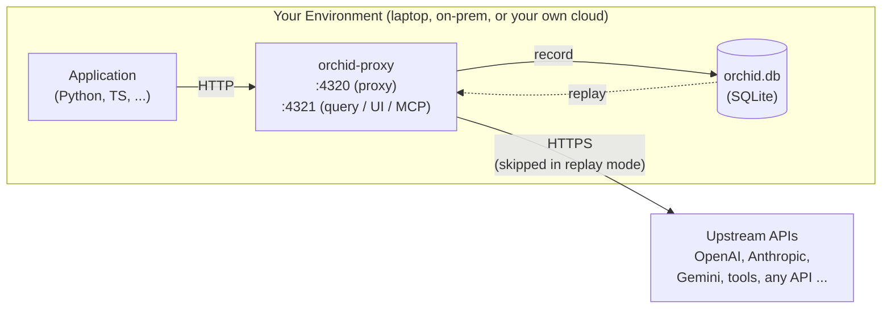

# Orchid — Record, Inspect, Replay AI Agents

[Orchid Website](https://orchidtrace.xyz)

**Stop grepping logs.** Orchid records your agent's network traffic — LLM calls, tool invocations, and any other API your agent talks to — through a zero-instrumentation proxy. Then it lets you:

*   **Time-travel** through completed runs, step by step
*   **Inspect** every prompt, response, token count, and cost
*   **Debug** failures in the built-in web UI or via MCP tools from your IDE
*   **Replay** recorded runs offline — deterministic tests with zero API cost

**Orchid gives your coding agent the ability to debug your AI app.** The proxy has a built-in MCP server, so when an LLM call is buried deep in your stack — behind a framework, a queue, three layers of abstraction — your AI assistant in Cursor, VS Code, or Claude Desktop can query the recorded traffic directly. No print statements, no log spelunking: ask your agent *"why did this run fail?"* and it can go look, figure out why, and fix it for you.

You choose how much to record: route only your LLM traffic through the proxy for lightweight inspection, or capture everything for the full picture. To **replay** a run with perfect fidelity, all of the agent's network traffic must go through the proxy — replay works by serving back the recorded responses, so anything that wasn't recorded can't be replayed.

> **IMPORTANT NOTE - YOUR DATA _NEVER_ LEAVES YOUR INFRASTRUCTURE!** 
>
> *   The proxy forwards requests **only** to the upstream APIs your app was already calling.
> *   Everything recorded stays in a local SQLite database inside the container (or your mounted volume). No phone-home, no telemetry, no cloud backend.
> *   Secrets are scrubbed in memory **before** anything is written to disk: `Authorization` headers are forwarded untouched to the upstream but never stored, and headers, query strings, and body fields with secret-like names (keys, tokens, passwords, credentials, cookies) are stored as `[REDACTED]`.
> *   One honest caveat: redaction works by recognizing field *names* (like `api_key` or `authorization`), not by scanning the contents of your prompts. Prompt and completion text is recorded verbatim — that's the whole point of Orchid — so if a secret is pasted into a prompt, it will be stored along with the rest of the prompt text.


This repository contains the open-source Orchid SDKs and user documentation. The `orchid-proxy` container is distributed via the GitHub Container Registry (see below). Content here is synced automatically from the main development repository — issues and discussions are welcome; pull requests may be ported rather than merged directly.

---

## How It Works



### Non-Intrusive Interception (Thin SDK)

Unlike traditional LLM observability tools that require wrapping every client initialization or using heavy SDKs with AST modifications, Orchid uses an **APM-style Thin SDK**. The SDK patches the foundational HTTP transport layer (`httpx`/`requests` in Python, `fetch` in Node), so every LLM call made by standard client libraries is automatically routed through the local or remote Orchid Proxy — without changing your prompt-handling or generation code.

### Header-Driven State Machine

The proxy does not keep track of application state. It reads `X-Orchid-*` HTTP headers (injected by the SDK, or set manually from any language) to decide how to process each request:

*   **`passthrough`**: Transparent reverse proxy. Forwards the request and returns the response without writing anything to disk.
*   **`capture`**: Forwards the request, serializes the complete request/response payloads (including streaming chunks), calculates costs, and saves them to a local SQLite database under a specific `Session ID`.
*   **`replay`**: Blocks all outbound network traffic. Hashes the incoming request and serves the exact matching recorded response from SQLite. If no match is found, returns a deterministic mock error.

---

## Key Features

### Forensic Capture
Every captured LLM call (or "Exchange") records:
*   **Request Metadata**: System prompts, user prompts, temperature, top-p, and custom tags.
*   **Response Telemetry**: Complete completion text, usage tokens (input/output), and latency.
*   **Cost Calculation**: Real-time USD cost attribution based on user-supplied model pricing maps (see [docs/configuration.md](docs/configuration.md) and the `/pricing` endpoint in [docs/api_reference.md](docs/api_reference.md)).
*   **Stream Reassembly**: For streaming completions, Orchid buffers SSE chunks in memory, serving them to the client instantly, and writes the fully reassembled completion body to SQLite.

### Deterministic Mock Replays
Writing mocks for LLM calls in tests is notoriously fragile and tedious. Orchid converts mock management into a simple recording flow:
1.  Run your test suite once in `capture` mode to generate a JSON fixture.
2.  Commit the fixture to your repository.
3.  Run CI in `replay` mode using the fixture. Your tests now execute instantly, offline, and with zero API cost.

Because replay serves responses from the local recording with near-zero latency, it also isolates **your own code's performance**: profile or benchmark your agent logic with network calls and upstream API variance taken out of the equation, and get reproducible numbers run after run.

### Embedded Visualizer Dashboard
The proxy embeds a React-based dashboard on port `4321` — nothing extra to install. Search and filter exchanges by model, provider, status, or prompt keywords; compare token usage and costs across sessions; export sessions as portable JSON fixtures.

<p align="center">
  
</p>

### MCP Server for AI Assistants
A built-in **MCP server** (SSE) lets AI assistants like Cursor, VS Code, or Claude Desktop query the recorded traffic directly: analyze prompt performance, pull token/cost statistics, or fetch payload examples as context for editing code.

<p align="center">
  
</p>

---

## Quick Start: Run the Orchid Proxy

The proxy ships as a multi-arch container image (Apple Silicon `arm64` and Linux `amd64`):

*   **Stable**: `ghcr.io/mario-guerra/orchid-proxy:latest`

### 0. Pull the Proxy Image

```bash
docker pull ghcr.io/mario-guerra/orchid-proxy:latest
```

### 1. Generate an API key
```bash
docker run --rm ghcr.io/mario-guerra/orchid-proxy:latest generate-api-key
```

### 2. Start the proxy

Start the container and pass your generated key as the `ORCHID_API_KEY` environment variable.

> [!IMPORTANT]
> **API Key is Mandatory in Docker**: The Orchid Proxy container binds to `0.0.0.0` (`ORCHID_BIND_HOST=0.0.0.0`) by default so that it can receive network traffic. Because it binds to a non-localhost address, setting `ORCHID_API_KEY` is **mandatory** when running inside Docker. If you attempt to start the container without setting `ORCHID_API_KEY`, the proxy will crash-exit on startup for security reasons.
>
> **Exempt Public Routes**: The health check endpoint (`/health`) and the static visualizer web assets (HTML, JS, CSS) on the query port (`4321`) do not require the key. This allows the visualizer UI to load in your browser, but it requires the key to load any session data (the screen will prompt you to enter the key). All proxying traffic on port `4320` and data API endpoints (under `/v1/*` and `/api/*` on port `4321`) are strictly auth-gated and require the key.


```bash
docker run -d \
  --name orchid-proxy \
  -p 4320:4320 \
  -p 4321:4321 \
  -v orchid-data:/data \
  -e ORCHID_API_KEY=your-secure-api-key \
  -e ORCHID_DB_PATH=/data/orchid.db \
  ghcr.io/mario-guerra/orchid-proxy:latest
```

*   **Recording Proxy**: `http://localhost:4320/v1` (pass `X-Orchid-Api-Key: your-secure-api-key` — the `Authorization` header is forwarded untouched to the upstream provider). Works for LLM endpoints and any other HTTP API you route through it.
*   **Query API / Visualizer UI**: `http://localhost:4321`

### 3. Point your app at the proxy

To intercept and record requests, you must configure your application to route its outbound HTTP traffic through the local proxy. You can do this in two ways:

#### Option A: Use the Thin SDK (Recommended)
Install the lightweight SDK and call the initialization helper at the very beginning of your application lifecycle. This automatically patches the global HTTP/HTTPS transport clients.

* **Python**: `pip install orchid-sdk`
  ```python
  import orchid
  orchid.init() # Must be called before initializing any LLM client
  ```
* **TypeScript/Node**: `npm install orchid-sdk`
  ```typescript
  import { init } from "orchid-sdk";
  await init(); // Must be called before initializing any LLM client
  ```

#### Option B: Native Base URL Routing (No SDK / Other Languages)
If you prefer not to use the SDK (or are using Go, Java, or Ruby), you can configure your LLM client directly. Set the API base URL to the proxy address (`http://localhost:4320/v1`) and pass your generated API key using the `X-Orchid-Api-Key` header:

* **Python example (OpenAI Client)**:
  ```python
  from openai import OpenAI
  
  client = OpenAI(
      base_url="http://localhost:4320/v1",
      default_headers={"X-Orchid-Api-Key": "your-secure-api-key"}
  )
  ```

For more configuration options and advanced setups (including cloud deployment templates), see [docs/getting_started.md](docs/getting_started.md) and [docs/configuration.md](docs/configuration.md).


### 4. Connect your AI assistant (MCP)

Hook the proxy's MCP server into Cursor, VS Code, or Claude Desktop and your coding agent gets direct visibility into your app's recorded LLM traffic. 

Add the configuration below to your IDE's `mcp_config.json` (e.g., `~/.gemini/antigravity-ide/mcp_config.json` or `~/Library/Application Support/Claude/mcp_config.json`):

```json
{
  "mcpServers": {
    "orchid-local": {
      "command": "docker",
      "args": [
        "exec",
        "-i",
        "orchid-proxy",
        "orchid-proxy",
        "--mcp"
      ]
    }
  }
}
```

This runs the MCP server process directly inside the running `orchid-proxy` container, sharing its database state without spinning up a separate container instance.

For other configuration options (like launching a standalone dedicated container or setting up a remote cloud tunnel), see the detailed [MCP Server Guide](docs/features/mcp_server.md).

### 5. Specify a recording session

By default, the proxy groups recorded request/response exchanges under `"default-session"`. You can organize your traces (e.g., by test run, feature sprint, or user ID) by explicitly specifying a session.

The proxy resolves the active session ID using the following precedence (from highest to lowest):

1. **Global Active Override**: Set dynamically via MCP (e.g., calling the `set_active_session` tool) or via the Control Plane API (`POST /sessions/active`). When set, this overrides all incoming session configurations.
2. **Programmatic SDK Scope**: Define a context block in your client application code to scope specific calls:
   * **Python**:
     ```python
     with orchid.session("my-feature-test", mode="capture"):
         # Intercepted LLM requests here are grouped under "my-feature-test"
         agent.run()
     ```
   * **TypeScript**:
     ```typescript
     import { session } from "orchid-sdk";

     await session("my-feature-test", "capture", async () => {
         // Intercepted LLM requests here are grouped under "my-feature-test"
         await agent.run();
     });
     ```
3. **HTTP Header (`X-Orchid-Session-Id`)**: Pass the session ID directly as an HTTP header on outbound requests. This is the primary method for custom integrations or unsupported SDK languages.
4. **Client Environment Variable (`ORCHID_SESSION_ID`)**: Set the variable in the environment where your application runs. The SDK will automatically read this and attach the header to all outbound calls.
5. **Proxy Environment Variable / CLI Config (`ORCHID_SESSION_ID`)**: Define the variable when starting the proxy process or Docker container. This serves as the default fallback for all incoming traffic.

### 6. Configure model pricing

To track LLM costs, you can load your model pricing definitions into the Orchid Proxy. By default, untracked models default to a cost of `$0.00`. Costs are defined in **USD per 1,000,000 tokens**.

Here is an example payload configured with up-to-date pricing for models used in the LangGraph project:
- **`gemini-2.5-flash`**: Input: $0.30, Output: $2.50
- **`o3-mini`**: Input: $1.10, Output: $4.40
- **`claude-3.5-sonnet` / `claude-sonnet-4-6`**: Input: $3.00, Output: $15.00

#### Method A: REST API (Push)

Send a `POST` request to the `/v1/pricing` endpoint on the query port (default `4321`):

```bash
curl -X POST http://localhost:4321/v1/pricing \
  -H "Content-Type: application/json" \
  -H "Authorization: Bearer your-secure-api-key" \
  -d '{
    "google": {
      "gemini-2.5-flash": {
        "prompt": 0.30,
        "completion": 2.50
      }
    },
    "openai": {
      "o3-mini": {
        "prompt": 1.10,
        "completion": 4.40
      }
    },
    "anthropic": {
      "claude-3.5-sonnet": {
        "prompt": 3.00,
        "completion": 15.00
      },
      "claude-sonnet-4-6": {
        "prompt": 3.00,
        "completion": 15.00
      }
    }
  }'
```

#### Method B: MCP Tool (`update_pricing`)

If your assistant is connected via MCP, it can configure model pricing by invoking the `update_pricing` tool. The tool expects a stringified JSON schema as the `pricing_json` parameter:

```json
{
  "name": "update_pricing",
  "arguments": {
    "pricing_json": "{\"google\":{\"gemini-2.5-flash\":{\"prompt\":0.30,\"completion\":2.50}},\"openai\":{\"o3-mini\":{\"prompt\":1.10,\"completion\":4.40}},\"anthropic\":{\"claude-3.5-sonnet\":{\"prompt\":3.00,\"completion\":15.00},\"claude-sonnet-4-6\":{\"prompt\":3.00,\"completion\":15.00}}}"
  }
}
```

After updating pricing, you can backfill cost metrics on previously recorded sessions by sending a POST request to `/v1/pricing/recompute` (or calling the `recompute_pricing` MCP tool).

### 7. Next steps

Once you have pointed your application to the proxy and configured model pricing, you are ready to start inspecting traces:

1. **Record traffic**: Run your application (or its test suite). The proxy will intercept and save all upstream LLM calls.
2. **Open the visualizer**: Navigate to `http://localhost:4321` in your browser. Enter your configured `ORCHID_API_KEY` when prompted to authorize and access the session dashboard.
3. **Analyze and debug**: Inspect your traces in real-time, view detailed token cost breakdowns, or replay execution paths.
4. **Explore further**: Check out the guides on [session recording](docs/features/session_recording.md) and [replay testing](docs/features/replay_testing.md) to build automated regressions.

---

## What's in this repository

| Path | Contents |
| --- | --- |
| `sdk/python/` | Python instrumentation SDK ([PyPI](https://pypi.org/project/orchid-sdk/)) |
| `sdk/typescript/` | TypeScript instrumentation SDK ([NPM](https://www.npmjs.com/package/orchid-sdk)) |
| `docs/` | Deployment, setup, and integration guides |

Additional language SDKs will be added under `sdk/` as they become available.

## License

Orchid SDKs are open source under the [Apache 2.0 License](LICENSE).

