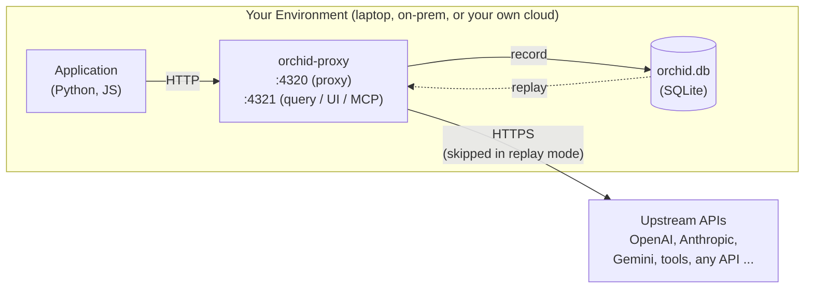

# Welcome to Orchid 🌸

[Orchid Website](https://orchidtrace.xyz)

Orchid is a lightweight, zero-dependency **Forensic Telemetry & Mock Replay Engine for LLM Applications**. 

If you are developing applications using LLM providers (like OpenAI, Anthropic, or Google Gemini), Orchid acts as a local or remote network-level sidecar that records every exchange, computes costs, and enables offline, deterministic testing with zero code-level mocking.

> [!IMPORTANT]
> **Your data never leaves your infrastructure.** Orchid is not a data exfiltration vector:
>
> *   The proxy forwards requests **only** to the upstream APIs your app was already calling.
> *   Everything recorded stays in a local SQLite database inside the container (or your mounted volume). No phone-home, no telemetry, no cloud backend.
> *   Secrets are scrubbed in memory **before** anything is written to disk: `Authorization` headers are forwarded untouched to the upstream but never stored, and headers, query strings, and body fields with secret-like names (keys, tokens, passwords, credentials, cookies) are stored as `[REDACTED]`.
> *   One honest caveat: redaction works by recognizing field *names* (like `api_key` or `authorization`), not by scanning the contents of your prompts. Prompt and completion text is recorded verbatim — that's the whole point of Orchid — so if a secret is pasted into a prompt, it will be stored along with the rest of the prompt text.

---

## 1. Core Concepts

### A. Non-Intrusive Interception (Thin SDK)
Unlike traditional LLM observability tools that require wrapping every client initialization or using heavy SDKs with AST (Abstract Syntax Tree) modifications, Orchid uses an **APM-style Thin SDK**. 

The SDK dynamically patches foundational HTTP client libraries (`httpx`, `requests`) at the transport level. This ensures that every LLM call made by standard SDKs is automatically routed through the local or remote Orchid Proxy—without requiring you to change your prompt-handling or generation code.

### B. Header-Driven State Machine
Orchid does not manage application state. Instead, it reads dynamic HTTP headers (`X-Orchid-*`) injected by the Thin SDK to decide how to process each request:
*   **`passthrough`**: The proxy acts as a transparent reverse proxy. It forwards the request to the upstream provider and returns the response immediately without writing anything to disk.
*   **`capture`**: The proxy forwards the request, serializes the complete request/response payloads (including streaming chunks), calculates costs, and saves them to a local SQLite database under a specific `Session ID`.
*   **`replay`**: The proxy blocks all outbound network traffic. It hashes the incoming request parameters and serves the exact matching response from the SQLite database. If no match is found, it returns a deterministic mock error.

---

## 2. Key Features

### 1. Forensic Capture
Every captured LLM call (or "Exchange") records:
*   **Request Metadata**: System prompts, user prompts, temperature, top-p, and custom tags.
*   **Response Telemetry**: Complete completion text, usage tokens (input/output), and latency.
*   **Cost Calculation**: Real-time USD cost attribution based on up-to-date model pricing maps.
*   **Stream Reassembly**: For streaming completions, Orchid buffers SSE chunks in memory, serving them to the client instantly, and writes the fully reassembled completion body to SQLite.

### 2. Deterministic Mock Replays
Writing mocks for LLM calls in unit/integration tests is notoriously fragile and tedious. Orchid converts mock management into a simple recording flow:
1.  Run your test suite once in `capture` mode to generate a JSON fixture.
2.  Commit the fixture to your repository.
3.  Configure your CI/CD pipeline to run in `replay` mode using the fixture. Your tests now execute instantly, offline, and with zero API cost.

Because replay serves responses from the local recording with near-zero latency, it also isolates **your own code's performance**: profile or benchmark your agent logic with network calls and upstream API variance taken out of the equation, and get reproducible numbers run after run.

### 3. Embedded Visualizer Dashboard
The proxy Axum server embeds a React-based SPA that serves a dashboard on port `4321`. This allows you to:
*   Search and filter logs by model, provider, status, or prompt keywords.
*   Compare token usage and costs across sessions.
*   Export and download recorded sessions as portable JSON fixtures.

### 4. Model Context Protocol (MCP) Server
Orchid exposes a built-in **MCP Server** via a Server-Sent Events (SSE) stream. This allows AI assistants (like Cursor, Claude Desktop, or custom coding agents) to interact directly with Orchid's SQLite database. Through natural language, your agent can:
*   Analyze prompt performance in recent sessions.
*   Query token count and cost usage statistics.
*   Search for specific payload examples to use as context for editing code.

---

## 3. Next Steps

To deploy the proxy and start collecting data, proceed to the:
👉 **[Developer Deployment & Setup Guide](./deploy_and_setup.md)**
👉 **[Storage Persistence & Network Mount Guide](./storage_persistence.md)**
👉 **[Using Orchid From Any Language (No SDK Required)](./any_language_integration.md)**
